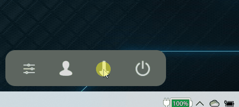
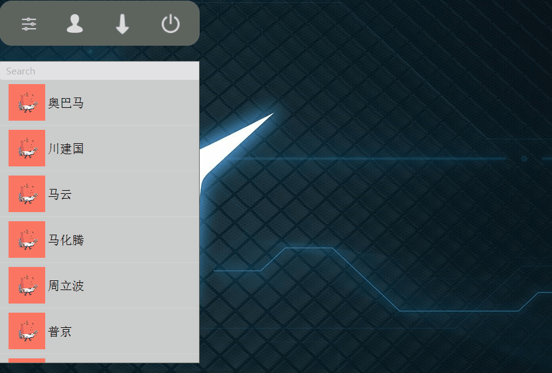
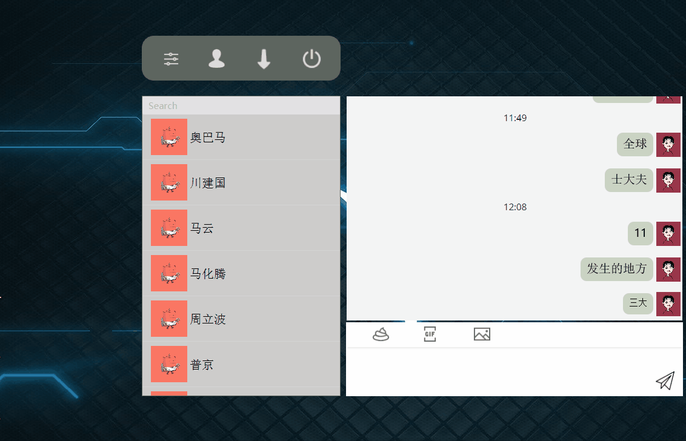

## 聊天程序1.0  

>  软件已上传到github  

#### 项目  

[项目地址](https://github.com/guyuedumingx/ChatFx.git)  

### 程序结构：  

#### 界面部分  

1. 操作面板  
	- `Controller` && `ChangeStage`  
	- 负责界面的切换，缩小化到系统图标，和关闭  
2. 设置面板  
	- `Controller` && `Settings`    
	- 用户可以设置：  
		- 历史记录的保存位置(支持调用系统的文件管理器来设置)   
		- 聊天气泡的颜色  
		- 文本颜色  
		- 文本大小  
3. 联系人面板  
	- `ContactWindows` 
	- 加载联系人  
	- 点击联系人可以打开和他的专属对话框  
	- 搜索联系人(没支持)  
4. 对话框操作界面  
	- `Controller` && `EditAndShow` && `ShowFlow`  
	- 显示联系人的历史记录  
	- 支持添加表情  
	- 支持调用系统的文件管理器来打开图片  
	- 输入面板  

#### 包  

1. `Control` 负责控制相关的类  
2. `Model` 负责`control`操作的实际对象  
3. `View` 负责存放`fxml`文件和一些图标  

#### 类结构  

```
Control 
	|--Alerts         弹窗警告类  
	|--ChangeStage    负责界面且切换，联系人的按键  
	|--Controller     软件的核心控制  
	|--Log4Chat       自己写的日志输出方法  
	|--Main           程序入口
	|--Settings       软件的基本设置 
Model  
	|--ContactWindows 联系人面板
	|--EditAndSandWindow 聊天面板的控制
	|--FButton        负责联系人的按键
	|--GifSelect      负责gif,没做完
	|--Friend         联系人类
	|--Operator       操作者类
	|--User           联系人与操作者的父类
	|--ReadHistory    负责读取历史记录
	|--WriteHistory   负责写入历史记录
	|--ShowFlow       负责聊天面板的显示部分
		|--TimeLabel  负责显示时间的标签
		|--Message    负责文本消息的气泡添加
		|--MessagePane 每条消息都在这个面板中，包括头像
View
	|--images         存放界面的一些图标
	|--Style.css      全局的样式表
	|--windows.fxml   界面全在这里
```

### 软件截图  

#### 拖动  
  

#### 最小化到系统托盘  
  

#### 聊天界面  
  
 
#### 窗口切换  
  

#### 导入图片  
  

#### 打开路径  
  


### 项目总结  

> 虽然程序目前并没有实现真正意义上的UDP 或TCP 通讯，但我已实现做了很多扩展性的支持，保证程序能够较为方便后期添加通讯功能 

为了写这个程序我去稍微了解了MVC模式和Clean Code 中的简洁代码，但是由于经验不足，可能有披漏，望谅解。  

1. 我尽量优化代码，追求代码能够像报纸一样阅读  

2. 我遵守一个方法只做一件事的原则  

3. 遵守尽量让方法名表达方法的功能  

4. 我尽量减少无意义的注释，避免注释破坏代码的完整性和可读性  

5. 但这其中仍有不足之处，望指正  

6. 为了写这个程序我耗费了大量的心血，自任务发布以来平均每天投入5+小时  

由于我对该程序的期望较高，目前的实现在我看来只是第一阶段，所以程序中可能存在着一些还未使用的方法或者还未完成的工作，这些工作我打算后续再跟进了。  

因为这个程序是用javafx写的，而我并没有系统的学习过javafx，一来是因为国内的javafx 资源正的不多，包括youtube,上也是寥寥无几，二来考核时间短，我没时间去啃官方文档，所以程序中的很多难点都是半百度，半API来的。可能有不规范的地方，望指出。 


列举难点：  


1. 布局方法  
2. 因为我没有使用系统的stage，造成的最小化，关闭都是自己写的，还有拖动窗口的实现  
3. javafx 在fxml中定义的组建在非controller类的引用问题  
4. 如何用代码添加组件  
5. javafx 组件无法序列化  
6. 问题5导致我决定只序列化内容，并实现历史记录归档保存问题  
7. showFlow 类的构造  
8. 聊天气泡的实现  
9. 消息头像的添加  
10. 操作者和联系人类的关系和作用，为将来登录界面，实现传输做铺垫  

> showFlow 类是非常大的难点。是本软件实现中出现的最大的困难  
> 其次是历史记录，我做了一个多星期，直接导致我放弃类android的考核  

```
日志类是我自己写的。java核心技术卷2还没看，不知道java本身就有  
```

历史记录的密钥来不急做了  
讲真，我是看不懂AES啥的  
